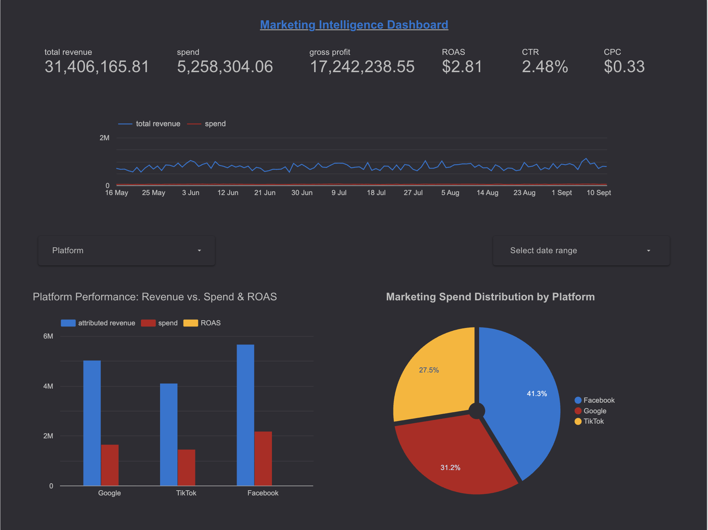

# Marketing Intelligence Dashboard

An interactive BI dashboard analyzing marketing spend and its impact on business outcomes, built with Looker Studio for the Lifesight Assessment.

## Live Dashboard

**You can view and interact with the live dashboard here:** [**LOOKER STUDIO LINK**](https://lookerstudio.google.com/reporting/ab82a2b2-564f-4633-a5fc-013bc1e5556d)

## Project Overview

The goal of this project was to take daily marketing and business data from an e-commerce brand and create a BI dashboard to help stakeholders understand the connection between marketing activities and business outcomes. The dashboard integrates data from Facebook, Google, TikTok, and internal business sources to provide a comprehensive view of performance.

## Key Features & Insights

The dashboard is built on two pages to tell a clear story:

* **Page 1: Marketing Performance Overview**
    * Displays high-level KPIs like Total Spend, Gross Profit, ROAS, CTR, and CPC.
    * Visualizes the relationship between total spend and total revenue over time.
    * Compares the performance (Spend, Attributed Revenue, ROAS) of each marketing platform.

* **Page 2: Business Impact & Efficiency**
    * Focuses on core business outcomes like Total Orders and New Customers Acquired.
    * Introduces deeper efficiency metrics like **CPA (Cost Per Order)** and **CAC (Customer Acquisition Cost)**.
    * Allows for a more sophisticated analysis of which platforms are most efficient at driving growth.

## Dashboard Preview

**Page 1: Marketing Overview**

**Page 2: Business Impact & Efficiency**

## Data Sources

The analysis is based on four `.csv` files:
* `Facebook.csv`
* `Google.csv`
* `TikTok.csv`
* `Business.csv`
